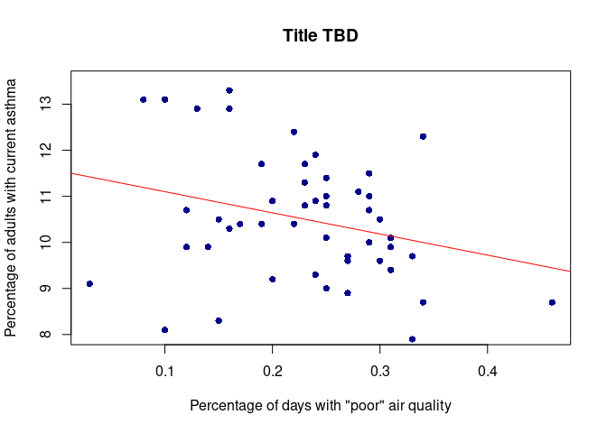

Final Rmarkdown Report
================
Corinne Hollyman
2025-10-30

- [ABSTRACT](#abstract)
- [BACKGROUND](#background)
- [STUDY QUESTION and HYPOTHESIS](#study-question-and-hypothesis)
  - [Questions](#questions)
  - [Hypothesis](#hypothesis)
  - [Prediction](#prediction)
- [METHODS](#methods)
  - [First Analysis- Scatterplot](#first-analysis--scatterplot)
  - [Second Analysis- TBD](#second-analysis--tbd)
- [DISCUSSION](#discussion)
  - [Interpretation of Scatterplot](#interpretation-of-scatterplot)
  - [Interpretation of Second
    Analysis](#interpretation-of-second-analysis)
- [CONCLUSION](#conclusion)
- [REFERENCES](#references)

# ABSTRACT

FILL OUT

# BACKGROUND

FILL OUT

# STUDY QUESTION and HYPOTHESIS

## Questions

DRAFT: Is there a correlation between the proportion of days with poor
air quality and the percent of adults with current asthma?

## Hypothesis

FILL OUT

## Prediction

FILL OUT

# METHODS

FILL OUT

## First Analysis- Scatterplot

``` r
my_data <- read.csv("Data for Final Rmarkdown Project.csv")

regression_model <- lm(my_data$Percent.Adults.with.Current.Asthma ~ my_data$Poor.Air.Quality.Days)

plot(my_data$Poor.Air.Quality.Days, my_data$Percent.Adults.with.Current.Asthma,
     ylim = c(8,13.5),
     main = "Title TBD",
     xlab = "Percentage of days with \"poor\" air quality",
     ylab = "Percentage of adults with current asthma",
     pch = 16,
     col = "blue4")

abline(regression_model, col="red") 
```

<!-- -->

## Second Analysis- TBD

This can be ignored, I was just testing this.

``` r
regression_model <- lm(my_data$Percent.Adults.with.Current.Asthma ~ my_data$Poor.Air.Quality.Days)

summary(regression_model)
```

    ## 
    ## Call:
    ## lm(formula = my_data$Percent.Adults.with.Current.Asthma ~ my_data$Poor.Air.Quality.Days)
    ## 
    ## Residuals:
    ##     Min      1Q  Median      3Q     Max 
    ## -3.0004 -0.7320 -0.1886  0.8188  2.4752 
    ## 
    ## Coefficients:
    ##                               Estimate Std. Error t value Pr(>|t|)    
    ## (Intercept)                    11.5595     0.5538  20.873   <2e-16 ***
    ## my_data$Poor.Air.Quality.Days  -4.5919     2.2811  -2.013   0.0497 *  
    ## ---
    ## Signif. codes:  0 '***' 0.001 '**' 0.01 '*' 0.05 '.' 0.1 ' ' 1
    ## 
    ## Residual standard error: 1.301 on 48 degrees of freedom
    ## Multiple R-squared:  0.07785,    Adjusted R-squared:  0.05864 
    ## F-statistic: 4.052 on 1 and 48 DF,  p-value: 0.04974

# DISCUSSION

## Interpretation of Scatterplot

FILL OUT

## Interpretation of Second Analysis

FILL OUT

# CONCLUSION

FILL OUT

# REFERENCES

FILL OUT
